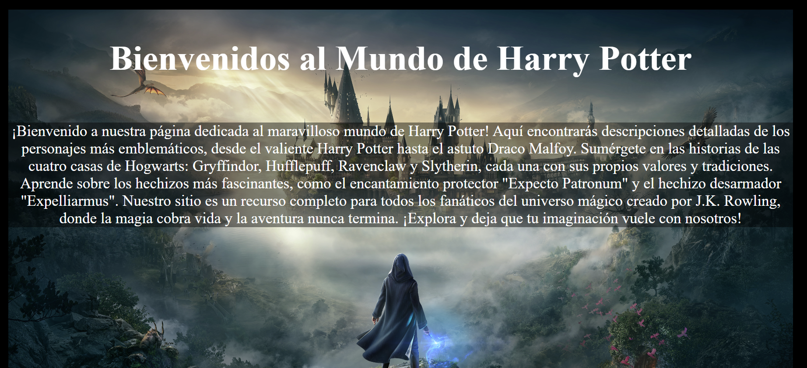

**PROYECTO Harry Potter**
Bienvenido a la página dedicada al mundo mágico de Harry Potter. Este proyecto reúne información sobre los libros, películas y personajes de la popular saga creada por J.K. Rowling.

##Contenidos
Libros: Una lista completa de los libros de Harry Potter con sus descripciones y detalles de publicación.
Películas: Información sobre las películas de Harry Potter, incluyendo detalles de estreno, directores, clasificaciones y duración.
Personajes: Detalles sobre los personajes más importantes de la saga, incluyendo actores, años de nacimiento, género y especie.
Estructura del Proyecto
El proyecto está dividido en varias secciones para una fácil navegación y acceso a la información.

##Libros
La sección de libros contiene una lista de todos los libros de la serie de Harry Potter. Cada entrada incluye:

Título del libro
Imagen de la portada
Año de publicación
Resumen del libro
Lista de Libros:
Harry Potter y la Piedra Filosofal (Publicado en 1997)
Harry Potter y la Cámara Secreta (Publicado en 1998)
Harry Potter y el prisionero de Azkaban (Publicado en 1999)
Harry Potter y el Cáliz de Fuego (Publicado en 2000)
Harry Potter y la Orden del Fénix (Publicado en 2003)
Harry Potter y el Misterio del Príncipe (Publicado en 2005)
Harry Potter y las Reliquias de la Muerte (Publicado en 2007)
Películas
La sección de películas proporciona detalles sobre cada una de las adaptaciones cinematográficas de los libros. Cada entrada incluye:

Título de la película
Año de estreno
Director
Curso correspondiente en Hogwarts
Clasificación por edades
Duración de la película
Personajes
La sección de personajes muestra información sobre los personajes principales de la saga. Cada entrada incluye:

Nombre del personaje
Actor o actriz que lo interpreta
Año de nacimiento del personaje
Género del personaje
Especie del personaje
Imagen del personaje
Tecnologías Utilizadas
HTML: Para estructurar el contenido de la página.
CSS: Para estilizar y mejorar la apariencia de la página.
JavaScript: Para manejar el contenido dinámico y las interacciones.
Uso
Para visualizar la página, simplemente abre el archivo index.html en tu navegador. Toda la información está organizada en secciones accesibles desde el menú principal.

##Contribuciones
Las contribuciones son bienvenidas. Si tienes información adicional o mejoras que desees sugerir, por favor, envía un pull request o crea un issue en el repositorio.

Autor
Este proyecto fue creado por [Alexis-M-Blanco].

## Contacto
GITHUB: https://github.com/alexisb1994

